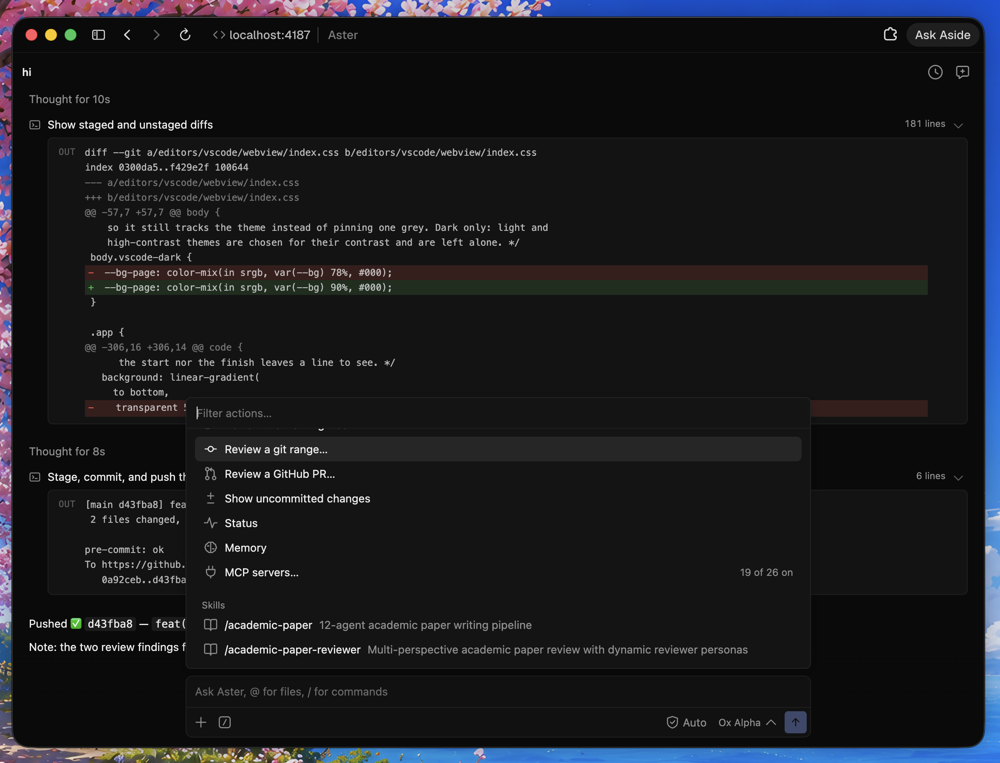

# ✳ Aster

**An open-source coding agent you run yourself, with the model you choose.**

[](https://github.com/zfinix/aster/actions/workflows/ci.yml)
[](./LICENSE)



Aster is a terminal agent that reads your code, answers questions, edits files,
runs commands, and reviews your changes. It works with any OpenAI-compatible
provider: OpenRouter, OpenAI, Groq, Anthropic, or a model running on your own
machine.

Three ideas shape it:

- **You own the whole thing.** Your key, your model, your machine. Sessions,
  memory, and skills are plain files on your disk. There is no hosted control
  plane, no vector database, and no telemetry. Point it at a local model and it
  works with no network at all.
- **A harness, not a prompt.** Tools, permissions, history, memory, and
  retrieval are shared infrastructure. Chat, review, and fix all inherit them,
  so a new capability is a small addition rather than another agent rebuilding
  the same scaffolding.
- **Make it prove things.** An agent that sounds right is not the same as one
  that is right. Aster spends extra model effort trying to disprove its own
  findings before showing them to you, and it tells you when it ran out of room
  instead of quietly wrapping up.

> **Status: early, building in the open.** Chat, review, memory, skills,
> permissions, MCP, and the browser, editor, and desktop surfaces have landed.
> Expect rough edges.

**I am job hunting.** I build Aster alone, and it is the best picture of how
I work. If your team is hiring for systems engineering or applied AI, email me
at [chiziaruhoma@gmail.com](mailto:chiziaruhoma@gmail.com).

## Install

```bash
curl -fsSL https://withaster.dev/install | sh
```

Or build it yourself (Rust 1.85 or newer):

```bash
git clone https://github.com/zfinix/aster && cd aster
cargo install --path crates/aster-cli
```

## Start here

```bash
aster init     # pick a provider, paste your key, done
cd your-repo
aster          # opens the chat
```

`aster init` writes `~/.aster/aster.yaml` and stores your key in `~/.aster/.env`,
so it applies to every repo. Prefer environment variables? Skip `init` and export
these instead:

```bash
export ASTER_API_KEY=sk-...
export ASTER_BASE_URL=https://openrouter.ai/api/v1
export ASTER_MODEL=anthropic/claude-sonnet-5
```

Then just talk to it:

```text
❯ where does the retry logic live?
❯ add a test for the empty-input case
❯ why is that finding critical?
```

Aster reads files, searches the repo, runs commands, and edits code when you let
it. Ask it something outside a repo and it still works, it just has less to look at.

## The chat

| Key | What it does |
| --- | --- |
| `enter` | Send. `esc` interrupts a running turn. |
| `esc esc` | Quit (two presses, so a stray one does not). |
| `shift+tab` | Step to the next permission mode. |
| `ctrl+j` | Newline without sending. |
| `@` | Mention a file from this repo. |
| `↑` `↓` | Step through what you have sent. |

Type `/` for commands:

| Command | What it does |
| --- | --- |
| `/switch` | Thinking, mode, effort, model and provider in one panel (also `ctrl+o`). |
| `/model` | Switch model, or pick from what the provider serves. |
| `/provider` | Switch to a different endpoint, then pick a model. |
| `/mode` | Choose how freely the agent edits (also `shift+tab`). |
| `/effort` | Reasoning budget: `off`, `low`, `medium`, `high`. |
| `/resume` | Reopen one of this repo's earlier sessions. |
| `/clear` | Start fresh. |
| `/help` | Everything above, in the terminal. |

`/compact`, `/status`, `/diff`, `/mcp`, `/skills`, `/memory`, `/thinking`,
`/yolo`, and `/quit` are there too; `/help` lists them all.

Outside the TUI:

```bash
aster chat "why is finding 2 critical?"   # one answer, then exit
echo "explain this repo" | aster          # piped input is the prompt
aster chat --continue                     # pick up the last session
aster chat --resume                       # choose a session from a list
```

## Where it runs

The terminal is the default. The same agent, the same repo, and the same
settings are also reachable three other ways.

### In your browser

```bash
aster serve                        # opens http://localhost:4187
aster serve --port 8080 --no-open  # somewhere else, without launching a window
```

Port 4187 is the default; when it is taken, the next free one is used and the
printed URL says so.

`aster serve` hands your browser the same panel the editor extension shows:
streaming replies, approvals, `@` mentions, slash commands, saved sessions,
review, and the model and permission pickers. Every turn runs as an `aster`
process in the repo you started the server in, so the keys, the model, and the
files are the ones the terminal would use. Nothing leaves the machine.

The page is served on loopback and refuses requests from any other page open in
your browser. `--host 0.0.0.0` reaches it from your phone or another machine on
the network, and the URL it prints then carries a token, because anything that
can reach the port could otherwise drive the agent.

### In your editor

The [VS Code extension](./editors/vscode) puts the same panel in the sidebar, an
editor tab, or its own window, with review findings wired into the Problems pane.

### As an app

The [desktop app](./desktop) is a standalone window around the same CLI, for
working without a terminal at all.

## How much it is allowed to do

One setting decides how freely the agent edits. Change it with `shift+tab`
mid-chat, `--permission-mode` for one run, or `permissions.mode` in `aster.yaml`.

| Mode | What it does |
| --- | --- |
| `plan` | Explores and proposes. Never edits, never runs a command. |
| `manual` | Asks before every edit and command. |
| `auto` | Edits and runs, pausing on risky commands like `sudo`, `rm`, and `curl`. |
| `edit` | As `auto`, but commands are trusted; only a rule stops one (the default). |
| `yolo` | No rules, no sandbox. Asks first, and turns the chat red. |

Rules decide the exceptions, in one language for all three tools:

```yaml
permissions:
  allow: ["Bash(cargo test:*)", "Edit(src/**)"]
  ask:   ["Edit(migrations/**)"]
  deny:  ["Bash(npm publish:*)"]
```

Out of the box, the agent asks before writing to `.git/`, workflow files, and
hooks in every mode, and refuses to read env and key files. The risky-command
pause is what `auto` adds over `edit`. A `Bash` rule reads inside `bash -lc "…"`,
so chaining a command does not slip it past the rule.

Outside yolo, commands run in a sandbox: writes are limited to the repo and temp
directories, and secrets are stripped from the environment. Widen or narrow any
of it under `permissions` in
[`aster.yaml.example`](./aster.yaml.example), documented in
[docs/CONFIG.md](./docs/CONFIG.md#permissions).

## Review your changes

Review is Aster's most developed capability. It does not just ask a model to
skim a diff, it tries to disprove what the model claims.

```bash
aster review                              # the current branch
aster review --range main..HEAD           # an explicit range
git diff HEAD~1 | aster review --diff -   # a diff on stdin
aster review --pr 42                      # a GitHub PR (run `aster login` first)
aster review --pr 42 --comment            # post the findings as PR comments
aster review --tui                        # browse findings interactively
aster review --json | aster fix --apply   # let it fix what it found
```

A finding looks like this:

```text
  ✳ 1 finding worth your attention.

  HIGH  correctness  1/1  74%
  Unchecked index can panic on an empty slice
  crates/aster-index/src/grep.rs:58
```

With `--json`, the same thing comes out as data for CI or another tool:

```json
[
  {
    "file_path": "crates/aster-index/src/grep.rs",
    "line": 58,
    "severity": "high",
    "category": "correctness",
    "title": "Unchecked index can panic on an empty slice",
    "suggestion": "Handle the PoisonError instead of unwrapping.",
    "confidence": 0.74
  }
]
```

### How review works


1. **Hypothesize.** A cheap model over-produces candidate defects from the diff.
   A candidate without a concrete failure scenario is dropped.
2. **Retrieve.** Pull only the evidence that candidate needs: the changed hunk, a
   window of source, the enclosing symbol, and references from a local SQLite and
   FTS5 symbol index. No repo-wide walk.
3. **Verify.** A second call, prompted to *refute*, kills plausible-but-wrong
   findings. A candidate survives only above `--min-confidence` (default 0.5).
   Point `ASTER_VERIFY_MODEL` at a stronger model for a real second opinion.
4. **Shape.** Deduplicate, rank by severity times confidence, and emit.

The expensive model is spent only on challenging what survived, never on the
whole diff. Full write-up in [docs/ALGORITHM.md](./docs/ALGORITHM.md).

One caveat worth knowing: the confidence gate filters the verifier's
*self-reported* confidence. That is a useful heuristic, not a calibrated
probability, so treat the number as a ranking signal rather than odds.

## The rest of the commands

| Command | What it is for |
| --- | --- |
| `aster memory` | Facts Aster should keep between sessions. `add`, `list`, `show`, `remove`. |
| `aster sessions` | Past conversations. `list`, `show`, `rename`, `delete`, `prune`, `import`. |
| `aster skills` | Reusable instructions the agent loads on demand. `add`, `list`, `find`, `use`, `bundled`, `update`, `init`, `remove`. |
| `aster plugins` | Agent Plugins packages of skills and MCP servers. `add`, `list`, `remove`, `validate`. |
| `aster config` | Everything in `aster.yaml`. `list`, `get`, `set`, `unset`, `path`, `edit`. |
| `aster provider` | The endpoint Aster talks to. `list`, `use`. |
| `aster model` | The model it runs. `list`, `use`, `recommended`. |
| `aster mcp` | MCP servers that give the agent more tools. `list`, `enable`, `disable`, `login`, `import`, `remove`. |
| `aster web` | The web as Markdown. `search`, `extract`, `crawl`, `sitemap`, `screenshot`. |
| `aster fix` | Turn review findings into edits. Dry run unless you pass `--apply`. |
| `aster serve` | Open the agent in your browser on this machine. |
| `aster status` | What the next turn would run with: model, mode, limits, wiring. |
| `aster remote` | Drive the agent from Telegram, approvals and all. |
| `aster login` | Link GitHub for PRs, or a provider account: `login codex`, `login openrouter`, `login zai`. `aster logout` removes them all. |
| `aster upgrade` | Download the latest released binary and swap it in place. |

`--json` works everywhere, before or after the subcommand. `--effort` sets the
reasoning budget on the commands that run a model: chat, `review`, and `fix`.

```bash
aster --json sessions list
aster review --effort high
```

### Provider and model

Aster talks to any OpenAI-compatible endpoint. Switching is one command, and it
switches everywhere: the terminal, the browser, the VS Code panel, and the
desktop app all resolve from the same `aster.yaml`.

```bash
aster provider list                        # the endpoints Aster knows
aster provider use openai                  # repoint, adopting a model it serves
aster provider use openai --model gpt-5.5  # or name the model yourself
aster model list                           # what this endpoint serves
aster model use gpt-5.5                    # change the model, keep the endpoint
```

`provider use` writes the endpoint and the model together, because an endpoint
kept with the last one's model fails on the next turn. Both commands then print
what the next turn actually resolves to, which is not always what you just
saved: `ASTER_MODEL` and `ASTER_BASE_URL` outrank the file, and either one being
set in your shell is reported rather than left to surprise you.

Keys follow the endpoint. A var named for it wins over the shared
`ASTER_API_KEY`, so `ANTHROPIC_API_KEY` is picked up the moment you switch to
Anthropic. In the TUI, `/provider` and `/model` do the same thing interactively.

### When a provider request fails

Every failed provider request is recorded locally at
`~/.aster/logs/provider-errors.jsonl`, one JSON line per failure: timestamp,
model, endpoint host, HTTP status, the response body (capped at 2 KB), and a
summary of what was sent (temperature, stream flag, reasoning effort, message
count, tool names). Keys and message contents are never written. The log is
capped at 1 MB and restarts when it fills.

When chat starts failing on every turn, read it first:

```bash
tail -5 ~/.aster/logs/provider-errors.jsonl | jq
```

A real example this log would have caught in one line instead of an afternoon:
a `400` from OpenRouter's stealth model whose body was just `ERROR`, caused by
`temperature` being serialized as an `f32`, so `0.4` went over the wire as
`0.4000000059604645` and the provider's strict validation rejected every single
request. The summary field records the exact temperature value sent, which is
the whole diagnosis. Wire-format fields are typed `f64` now so it cannot come
back.

For deeper tracing, set `OTEL_EXPORTER_OTLP_ENDPOINT` to export spans of each
model request (op, model, status) to any OTLP collector. It is off by default
and costs nothing when unset.


### Settings

`aster.yaml` holds everything else, and `aster config` edits it without opening
it. On its own it opens a form listing every setting and what it currently
resolves to; piped or scripted, it prints that as a table and every step has a
flag.

```bash
aster config                       # the form, or the table when piped
aster config set permissions.mode auto
aster config set review.exclude "docs/**, web/**"
aster config unset agent.max_tool_rounds
```

Writes land in the repo's config when it has one, else the global one;
`--global` and `--local` say which. The file is parsed before it is saved, so a
misspelled key is an error rather than a surprise on the next turn, and reads
name where a value came from, since a shell variable outranks the file. Full
reference in [docs/CONFIG.md](./docs/CONFIG.md).

### Memory

```bash
aster memory add "we deploy from the release branch, never main"
aster memory add "prefers terse replies" --title tone
aster memory list
aster memory remove tone
```

Short facts go into project memory, which is always in context. Named blocks are
listed by title and read in full only when the agent needs them.

### Skills

Skills are folders with a `SKILL.md` telling the agent how to do something
specific. Aster reads the titles and loads the body only when it is relevant.

Eleven core skills ship built in and are always available: git and GitHub
workflows, verification before reporting done, build triage, shell batching,
CLI craft, context economy, taking corrections, security hygiene, security
review, and web research. Ten more are bundled but off by default (debugging, refactoring,
tests, dependency upgrades, supply-chain safety, background processes, and
others);
`aster skills bundled` lists them. On macOS one bundled skill, macos-harness
(drive apps, the browser, and the filesystem from one Python session), is
installed into your global skills root on first run; removing it with
`aster skills remove` keeps it removed. Installing any skill with the same
name overrides its built-in.

```bash
aster skills find react          # search GitHub for skills
aster skills add owner/repo      # install from a repo
aster skills add ./my-skill -p   # install into this project only
aster skills add claude-code     # import from another agent on this machine
aster skills bundled             # list the optional built-in skills
aster skills bundled write-tests # turn one on
aster skills list
```

Any agent key from the [skills](https://github.com/vercel-labs/skills) registry
works as a source, so skills already installed for Claude Code, Cursor, Codex,
Gemini CLI, and the rest come across as-is. `aster skills add` with no source
lists the ones it finds installed.

### Plugins

A plugin packages skills and MCP servers together in one directory, in the
vendor-neutral [Agent Plugins](https://github.com/agentplugins/agent-plugins-spec)
format. Anything published for a conformant client installs here unchanged.

```bash
aster plugins add owner/repo        # install from a repo
aster plugins add ./my-plugin -p    # install into this project only
aster plugins list                  # what is installed and what it contributes
aster plugins validate ./my-plugin  # check a package you are authoring
```

Its skills join the skill index and its MCP servers join the configured ones as
`<plugin>/<server>`. See [docs/PLUGINS.md](./docs/PLUGINS.md).

### MCP servers

MCP servers add tools like a browser or a GitHub client. Declare them under
`mcp.servers` in `aster.yaml`: a `command` to run one locally, or a `url` for a
remote one over Streamable HTTP or the older SSE transport. Then:

```bash
aster mcp list              # what is configured, and what it offers
aster mcp enable chrome     # turn one on
aster mcp disable chrome    # turn it off, keep the config
```

Tools are injected progressively, so a large server does not eat your context.
See [docs/MCP.md](./docs/MCP.md).

## Model switching with mom.yaml

Drop a `mom.yaml` in your repo root (or `~/.aster/mom.yaml`) and Aster picks
the model per turn instead of running one model all session. Entries describe
what you want in plain words; rules say when to switch; the router judges
everything the rules don't cover.

```yaml
mom: "0.1"
models:
  everyday:
    description: "routine coding: small edits, tests, direct questions"
    power: medium
    prefer: [zai/glm-5.3-flash]
  deep:
    description: "hard work: planning, debugging, multi-file refactors"
    power: max
    thinking: deep
    prefer: [zai/glm-5.3]

start-with: everyday

router:
  enabled: true      # a cheap model reads each message and picks the entry
  power: low
  prefer: [zai/glm-5.3-flash]

switch:
  - when: planning
    use: deep
  - when: [stuck, looping, model-down]
    use: deep
```

Rules always win; the router only fills the gaps, so a hard request escalates
on its first turn instead of after something fails. Every switch shows in the
chat as a `mom:` note, `/mom` shows the current state, and `aster mom check`
validates the file and shows what each entry resolves to. Router decisions log
to `~/.aster/logs/mom-router.jsonl`, switches to `~/.aster/logs/mom-switches.jsonl`.

Picking a model yourself (`/model`) suspends the manifest; `/mom resume` puts
it back in charge. The format is an open spec: [specs/mom.md](./specs/mom.md),
with a JSON schema and starter files in [specs/mom-examples](./specs/mom-examples).
The model catalog used for resolution ships inside the binary and refreshes
with each release.

## Configuration

Order of precedence: **CLI flags, then environment, then `aster.yaml`, then
defaults.** API keys are read from the environment only, never from the yaml.

`aster.yaml` is read from your repo root, then `~/.aster/aster.yaml` for
everything else. Copy [`aster.yaml.example`](./aster.yaml.example) to get
started. Every key, its default, and how the two files merge is in
[docs/CONFIG.md](./docs/CONFIG.md).

| Env var | What it does | Default |
| --- | --- | --- |
| `ASTER_API_KEY` | Your provider key (required) | none |
| `ASTER_BASE_URL` | Any OpenAI-compatible endpoint | `https://openrouter.ai/api/v1` |
| `ASTER_MODEL` | The model to use | `openai/gpt-4o-mini` |
| `ASTER_EFFORT` | Thinking budget: `off`, `low`, `medium`, `high` | `low` |
| `ASTER_MAX_TOOL_ROUNDS` | Tool calls in one turn before it must answer | `60` |
| `ASTER_COMMAND_TIMEOUT` | Seconds a single command may run | `300` |
| `ASTER_VERIFY_MODEL` | A stronger model for review's verify pass | same as `ASTER_MODEL` |
| `ASTER_HYPOTHESIS_MODEL` | A cheap model for review's first pass | same as `ASTER_MODEL` |
| `ASTER_MAX_TOKENS` | Cap generated tokens (`off` disables) | `8000` |
| `ASTER_SEED` | Fixed sampling seed (`off` disables) | `0` |
| `ASTER_COMPACT_BUDGET` | History size that triggers auto-compaction, in chars | `192000` |
| `ASTER_WEB_SEARCH` | `1` turns review's web search back on | off |
| `ASTER_NO_BROWSER` | Never launch a browser; report URLs instead | unset |

[`.env.example`](./.env.example) lists every variable with notes.

## Going deeper

The three ideas at the top are the short version. The long version, with the
diagrams and the reasoning behind each decision, lives in the docs:

| Doc | What it covers |
| --- | --- |
| [CONFIG.md](./docs/CONFIG.md) | Every `aster.yaml` key, its default, and how files merge. |
| [ARCHITECTURE.md](./docs/ARCHITECTURE.md) | How the crates fit together and what a turn does end to end. |
| [ALGORITHM.md](./docs/ALGORITHM.md) | The review pipeline and its cost model. |
| [HARNESS.md](./docs/HARNESS.md) | Sessions, memory, approvals, and delegation. |
| [SWARM.md](./docs/SWARM.md) | Sub-agents: the persona roster, fan-out, live events, and custom `AGENT.md` definitions. |
| [MEMORY.md](./docs/MEMORY.md) | What Aster remembers, and how it is disclosed. |
| [MCP.md](./docs/MCP.md) | Progressive tool injection: one bridge, schemas on demand. |
| [PLUGINS.md](./docs/PLUGINS.md) | The Agent Plugins package format, and what Aster supports. |
| [ANALYZERS.md](./docs/ANALYZERS.md) | Wiring semgrep and ast-grep into review. |
| [EVAL.md](./docs/EVAL.md) | How Aster measures itself, and what those numbers cannot claim. |
| [ROADMAP.md](./docs/ROADMAP.md) | What is next. |

## Repository layout

```text
crates/
  aster-cli/         the `aster` command-line interface
  aster-ai/          provider-agnostic OpenAI-compatible chat client
  aster-harness/     the verification-first review pipeline
  aster-index/       code index: SQLite + FTS5 + ripgrep
  aster-analyzers/   static analysis (semgrep / ast-grep)
  symbol-extractor/  tree-sitter symbol extraction (14 languages)
  aster-persist/     sessions and project memory
  aster-skills/      on-demand instructions
  aster-agents/      specialized agent definitions
  aster-tools/       the tools a turn can call
  aster-sandbox/     where commands are allowed to run
  aster-policy/      read, write, and command permissions
  aster-mcp/         progressive MCP tool injection
  aster-plugins/     Agent Plugins packages: manifest, skills, MCP config
  aster-web/         web search, fetch, and crawl
  aster-serve/       `aster serve`: the browser UI and its host
  aster-remote/      driving the agent from a messaging app
  aster-eval/        the evaluation harness
  aster-telemetry/   optional OpenTelemetry export
  aster-shortcuts/   shared keybinding definitions
  aster-models/      shared domain types
desktop/             the desktop app (Tauri)
editors/vscode/      the VS Code extension, and the panel `aster serve` hands a browser
web/                 withaster.dev, including the install script
docs/                config, architecture, algorithm, memory, MCP, plugins, roadmap
```

## Contributing

Contributions are welcome. [CONTRIBUTING.md](./CONTRIBUTING.md) has the dev setup
and the three checks CI runs: `fmt`, `clippy`, `test`. For security issues, see
[SECURITY.md](./SECURITY.md).

## License

[Apache-2.0](./LICENSE). See [NOTICE](./NOTICE).
