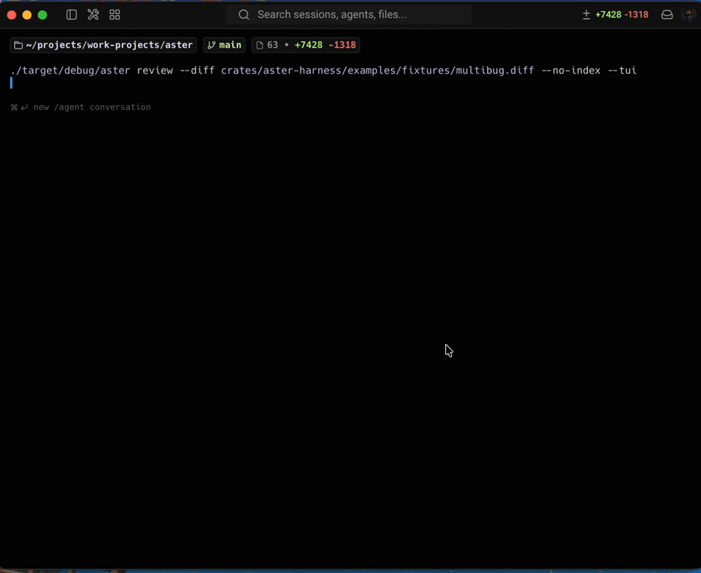
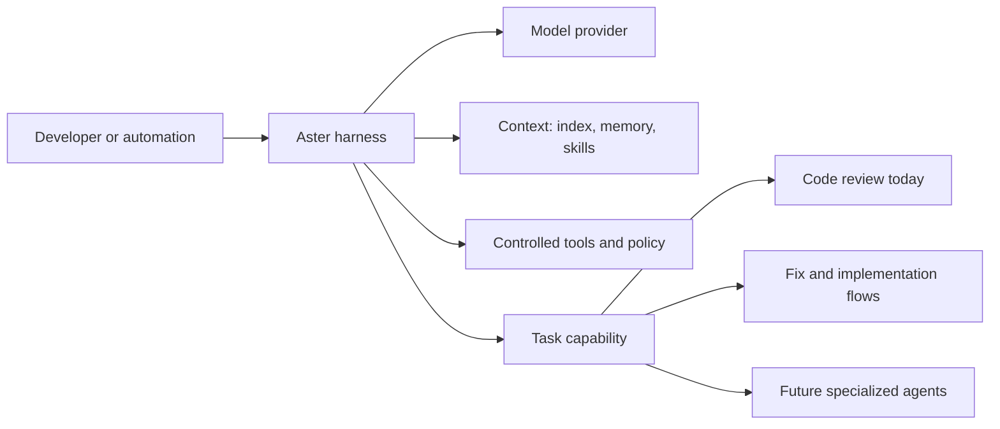
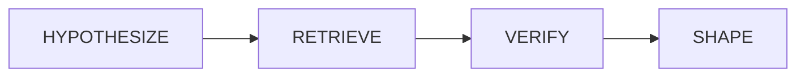

# ✳ Aster

**An open-source agent harness for software work.**

Self-hostable, bring-your-own-model agents with controlled tools, durable
context, and verification-first capabilities.

[](https://github.com/zfinix/aster/actions/workflows/ci.yml)
[](./LICENSE)

Built by [Instalog](https://instalog.dev).

---

> **Status: early, building in the open.** The agent runtime, chat, memory,
> skills, policy layer, and first verification capability have landed. See [docs/](./docs).

## What is Aster?



Aster is the operating layer for agents that work in a codebase. It combines a
model you choose with bounded context, local retrieval, durable memory, skills,
agent definitions, and a policy-controlled tool surface. It is model-agnostic
(any OpenAI-compatible provider) and self-hostable (no vector DB or hosted
control plane in the core).

Code review is Aster's first mature capability, not its boundary. The same
harness can support exploration, implementation, maintenance, and future
specialized agents without each workflow rebuilding memory, tools, policy, and
context management from scratch.

## The harness



The harness provides:

- **A controlled agent runtime.** Chat, tool loops, policy decisions, session
  persistence, and machine-readable interfaces are shared infrastructure.
- **Context that stays useful.** Local source retrieval, durable project memory,
  and progressively loaded skills keep agents grounded without filling every
  request with the whole repository.
- **Composable capabilities.** Review, fix, and chat use the same primitives;
  agent definitions and MCP injection make the surface extensible.
- **Verification where it matters.** Aster can spend extra model effort to
  challenge high-impact outputs instead of treating every task as free-form
  generation.

## Why Aster

- **Harness, not a prompt.** Workflows inherit tools, policy, history, and
  retrieval instead of reassembling them in a one-off agent prompt.
- **BYO model, no lock-in.** Any OpenAI-compatible endpoint: OpenRouter, Groq,
  OpenAI, or a local llama.cpp server.
- **Self-host first.** Local files and SQLite/FTS5 are the source of context;
  no hosted control plane is required.
- **Verification-first.** Code review demonstrates the approach: hypotheses are
  retrieved, challenged, and shaped before they are shown to a developer.

The review capability is deliberately demanding: compared with a plain
"review this diff" prompt, it retrieves targeted evidence, refutes candidate
findings, and emits a confidence-gated result.

## Install

Aster is pre-release, so build it from source (Rust >= 1.85, edition 2024):

```bash
git clone https://github.com/zfinix/aster
cd aster
cargo install --path crates/aster-cli    # installs the `aster` binary
```

Or build without installing: `cargo build --release -p aster-cli` puts the
binary at `target/release/aster`.

## Quick start: review

Point Aster at a model provider, then review your current branch:

```bash
export ASTER_API_KEY=sk-...                          # your provider key
export ASTER_BASE_URL=https://openrouter.ai/api/v1   # or Groq / OpenAI / local
export ASTER_MODEL=openai/gpt-4o-mini

cd your-repo
aster review                     # reviews the current branch vs its base
```

More ways to scope a review:

```bash
aster review --range main..HEAD           # an explicit git range
git diff HEAD~1 | aster review --diff -    # a diff from stdin
aster review --pr 42                       # a GitHub PR (needs `aster login`)
aster review --pr 42 --comment             # post findings as inline PR comments

aster review --json                        # machine-readable output
aster review --tui                         # browse findings interactively
aster review -i "src/**/*.rs" -x "**/*.gen.rs"   # include / exclude globs
```

Run `aster review --help` for every flag.

## Available capabilities

| Capability | Surface | Purpose |
| --- | --- | --- |
| Verification-first review | `aster review` | Finds and refutes candidate defects in a diff or pull request. |
| Codebase agent | `aster chat` | Explores a repository, reads files, searches, recalls memory, and can edit under policy. |
| Guided fixes | `aster fix` | Produces and applies review-driven changes through Aster's edit controls. |
| Durable context | `aster sessions`, `aster memory` | Resumable transcripts and progressively disclosed project memory. |
| Reusable workflows | `aster skills` and agent definitions | On-demand instructions and specialized agent roles. |
| External capability boundary | `aster-mcp` | Progressive MCP tool injection; transport wiring is the next integration step. |

## What a finding looks like

Text output (the default) leads with a summary, then each finding with its
severity, category, confidence, and location:

```
  ● 1 finding worth your attention.

  HIGH  correctness  1/1  74%
  Unchecked index can panic on an empty slice
  crates/aster-index/src/grep.rs:58
```

With `--json`, the same finding is emitted as structured data ready for CI or a
fix-agent:

```json
[
  {
    "file_path": "crates/aster-index/src/grep.rs",
    "line": 58,
    "severity": "high",
    "category": "correctness",
    "title": "Unchecked index can panic on an empty slice",
    "description": "into_inner().unwrap() assumes the mutex is uncontended; a poisoned lock panics the worker.",
    "suggestion": "Handle the PoisonError instead of unwrapping.",
    "confidence": 0.74
  }
]
```

## How review works

A cost-staged, verification-first pipeline:



1. **Hypothesize.** A *cheap* model over-produces candidate defects from the
   diff. Every candidate must carry a concrete `failure_scenario` or it is dropped.
2. **Retrieve.** Pull only the evidence that candidate's scenario needs: the
   changed hunk, a source window, the enclosing symbol and its definition, and
   references drawn from a local SQLite/FTS5 symbol index (no repo-wide walk).
3. **Verify.** A second model call, prompted to **refute**, kills
   plausible-but-wrong findings. A candidate survives only if the verifier
   reports confidence above a configurable threshold (`--min-confidence`, default 0.5).
   The verify pass uses the same model as hypothesis by default. Point it at a
   separate, stronger model with `ASTER_VERIFY_MODEL` for true independence.
4. **Shape.** Dedup (collapsing the same defect surfaced by multiple sources)
   and rank by `severity × confidence`, then emit canonical findings ready for
   inline comments, Linear issues, or a future fix-agent.

The expensive tier is spent only on adversarial verification of what survives,
never on the whole diff. Full write-up: [docs/ALGORITHM.md](./docs/ALGORITHM.md).

> **On precision.** The confidence gate filters the verifier's *self-reported*
> confidence, which is a useful heuristic, not a calibrated probability. Aster's
> end-to-end precision and false-positive rate are measured by the eval in
> [docs/BENCHMARKS.md](./docs/BENCHMARKS.md). Treat headline precision claims as
> backed by those numbers, not by the gate alone.

## Configuration

Precedence: **CLI flags > shell env > `aster.yaml` > built-in defaults.** API
keys are read only from the environment (or `aster login`), never from the file.

| Env var | Purpose | Default |
| --- | --- | --- |
| `ASTER_API_KEY` | Provider API key (required) | none |
| `ASTER_BASE_URL` | OpenAI-compatible endpoint | `https://openrouter.ai/api/v1` |
| `ASTER_MODEL` | Default model for any stage without an override | `openai/gpt-4o-mini` |
| `ASTER_HYPOTHESIS_MODEL` | Cheap, high-recall model for the hypothesis pass | falls back to `ASTER_MODEL` |
| `ASTER_VERIFY_MODEL` | Independent model for the adversarial verify pass | falls back to `ASTER_MODEL` |
| `ASTER_REASONING_EFFORT` | Thinking budget: `low` / `medium` / `high` / `off` | `low` |
| `ASTER_MAX_TOKENS` | Cap generated tokens (`0` or `off` disables) | `8000` |
| `ASTER_SEED` | Fixed sampling seed for reproducibility (`off` disables) | `0` |

For repo-level defaults (models, `min_confidence`, analyzers, include/exclude
globs), copy [`aster.yaml.example`](./aster.yaml.example) to `aster.yaml` in your
repo root. See [`.env.example`](./.env.example) for the full annotated env list.

## Repository layout

```
crates/
  aster-models/      domain types: findings, symbols, Candidate/Verdict
  aster-ai/          provider-agnostic OpenAI-compatible chat client
  aster-index/       zero-dep code index: SQLite + FTS5 + ripgrep
  aster-analyzers/   static-analysis engine (semgrep / ast-grep)
  symbol-extractor/  tree-sitter-tags symbol extraction (14 languages)
  aster-harness/     verification-first review capability
  aster-persist/     append-only sessions + progressive project memory
  aster-skills/      on-demand workflow instructions
  aster-agents/      specialized agent definitions and discovery
  aster-policy/      controlled read/edit decisions
  aster-mcp/         progressive MCP injection: one bridge, on-demand schemas
  aster-cli/         the `aster` command-line interface
docs/
  ARCHITECTURE.md    crates + runtime diagrams
  ALGORITHM.md       the algorithm + cost model (paper notes)
  ANALYZERS.md       static-analysis integration
  BENCHMARKS.md      how the hypothesis model was chosen (reproducible)
```

MCP tool injection is designed around progressive disclosure; see
[docs/MCP.md](./docs/MCP.md).

## Contributing

Contributions are welcome. See [CONTRIBUTING.md](./CONTRIBUTING.md) for the dev
setup and the three checks CI runs (`fmt`, `clippy`, `test`). For security
issues, see [SECURITY.md](./SECURITY.md).

## License

[Apache-2.0](./LICENSE). See [NOTICE](./NOTICE).
