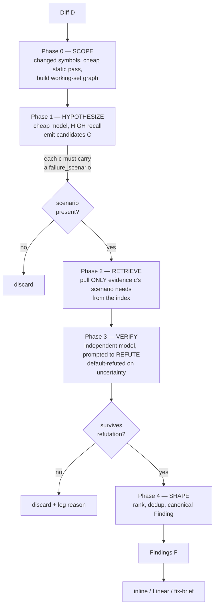

# The Aster Review Algorithm

> Working notes toward a paper: *"Cheap, high-precision AI code review via
> cost-staged adversarial verification."*

## Problem statement

Given a diff `D` against a base revision, emit a set of findings `F` such that:

- **Precision** is high — nearly every emitted finding is a real, reproducible
  defect (false positives destroy reviewer trust faster than false negatives
  destroy coverage).
- **Actionability** — every finding names a location, a concrete failure
  scenario, and a fix direction.
- **Cost** approaches zero — measured in model tokens per reviewed diff.

The central tension in LLM code review is that **precision and cost pull against
each other under the naive design**: to raise precision you feed the model more
context, which raises cost and, past a point, *lowers* precision through signal
dilution. Aster's claim is that this tension dissolves if recall and precision
are separated across cost stages, and if context is *retrieved* rather than
*stuffed*.

## The pipeline



## Stage-by-stage

### Phase 1 — Hypothesize (recall)

A **cheap** model runs once over the (truncated) diff with a high-recall prompt:
deliberately over-produce candidate defects. The output is JSON. The critical
design rule:

> **Every candidate must carry a `failure_scenario` at birth** — concrete inputs
> or state leading to wrong behavior. A candidate that cannot state one is
> discarded *before* it costs a verification token.

This is a free precision filter. A "defect" with no expressible failure mode is,
by construction, either unactionable or a hallucination. The mandatory scenario
also becomes the *anchor* the verifier attacks in Phase 3.

### Phase 2 — Retrieve (working set)

For each surviving candidate, assemble a bounded working set: the changed diff
hunk, a source window around the flagged line, the enclosing symbol and its
definition, and references (callers/tests) to that symbol. Symbols and
references come from a local SQLite/FTS5 index built with tree-sitter-tags
extraction; references are found by full-text search over stored symbol bodies,
not a repo-wide walk. Reference lookup is skipped for very common identifiers,
where a name match is mostly noise, and the whole set is capped in bytes so the
verifier sees a working set, not the repository.

### Phase 3 — Verify (precision)

A second model call — a different, adversarial prompt instructed to **refute**
the candidate — evaluates the concrete `failure_scenario` against the retrieved
evidence and the changed hunk. A candidate survives only if the verifier reports
`real: true` **and** a confidence at or above a configurable threshold
(default 0.5); everything else is dropped.

Two honesty notes on what this does and does not guarantee:

- **Independence is opt-in, not automatic.** The verifier gets a different
  (adversarial) prompt, but by default it runs on the *same model* as
  hypothesis and is handed the candidate's own title and scenario as framing.
  For genuine independence — a distinct, ideally stronger tier that does not
  inherit the hypothesizer's model — set `ASTER_VERIFY_MODEL` (or
  `verify_model` in `aster.yaml`). Until then, treat "independent" as the
  intended configuration, not the default behavior.
- **The confidence gate filters a self-reported number.** A model's stated
  confidence is a useful signal, not a calibrated probability; the threshold is
  a heuristic cage, not a precision guarantee. The precision the gate actually
  buys is what the Phase-3 evaluation measures, not what the number asserts.

Running `N` skeptics with distinct lenses (does-it-reproduce / security /
correctness) and killing on majority-refute is a stronger cage than a single
self-reported confidence; it is described in the evaluation plan as future work,
not yet implemented.

### Phase 4 — Shape (delivery)

Survivors are ranked by `severity × confidence` and deduped by collapsing
findings that describe the **same defect** — same file and line with clearly
overlapping titles — so a defect surfaced by both a static analyzer and the
model reports once, while distinct bugs on the same line are preserved. The
result is the canonical `Finding`, which every downstream sink (inline comments,
Linear tickets, fix-briefs) consumes.

## Cost model

Let a naive one-shot reviewer cost `T_naive = T_ctx + T_out`, where `T_ctx` is
dominated by whole-file/history stuffing. Aster's cost is:

```
T_aster ≈ T_diff                     (phase 1, cheap model, diff only)
        + Σ_survivors ( T_evidence_i  + T_verify_i )   (phase 3, only survivors)
```

Two levers drive `T_aster` toward zero relative to `T_naive`:

1. **Phase 1 sees only the diff**, on the cheapest model. No whole-file context.
2. **Phase 3 runs only on candidates that passed the scenario gate and
   retrieval** — typically a small fraction — and its context is the *minimal
   working set*, not the repository.

The expensive tier is spent exclusively on *adversarial verification of what
survived*, never on the whole diff. This is what makes the pipeline cheap; the
precision it achieves at that cost is an empirical question, measured by the
Phase-3 evaluation rather than assumed.

## Where uncertainty is caged

Framed in harness terms, the question is always *"which layer caters the
uncertainty of a wrong finding?"* Aster's answer:

| Uncertainty | Caged by |
|---|---|
| "Is this even a defect?" | Phase-1 mandatory `failure_scenario` gate |
| "Does the scenario actually hold?" | Phase-3 adversarial refute + confidence threshold (independence opt-in) |
| "Is the model hallucinating context?" | Phase-2 retrieval — model only sees earned evidence |
| "Runaway cost" | Cost staging — expensive tier only on survivors; bounded retries with a total deadline |

## Evaluation plan (for the paper)

- **Datasets:** curated PRs with known-planted bugs; real merged PRs with
  post-merge revert/fix signals as weak labels; SWE-bench-style defect sets.
- **Metrics:** precision@k, recall, false-positive rate, **tokens per review**,
  **$ per real finding**, actionability (human rating), fix-acceptance rate.
- **Baselines:** one-shot GPT-4-class review; whole-file-context review;
  CodeRabbit-style agentic review; static analyzers alone (opengrep/semgrep).
- **Ablations:** remove the scenario gate; remove independent verification
  (self-verify); replace retrieval with whole-file stuffing; single vs.
  N-skeptic verification. Each ablation isolates one uncertainty-caging layer.

## Open questions

- Optimal `N` and lens set for adversarial verification vs. marginal cost.
- Loop-until-dry hypothesis (repeat Phase 1 until K rounds find nothing new) for
  high-assurance audits vs. single-pass for cheap PR review.
- Cross-PR state: dedup findings against *already-filed* Linear issues so the
  same bug is not re-reported every push (a "verify against seen, not just
  found" problem).
- Fix-agent handoff: is the `Finding` object sufficient for a headless fixer to
  act, or does it need a richer repair brief (patch sketch, test to satisfy)?
