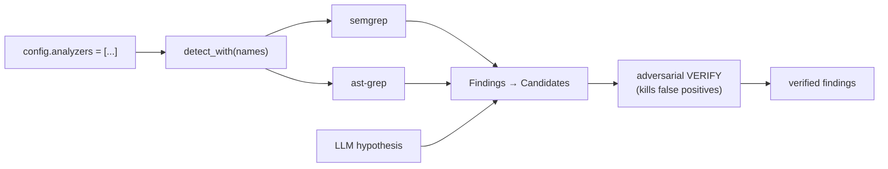

# Static-analysis backends (analyzer modes)

Aster runs static analyzers as a **candidate source** that feeds the same
adversarial verification as LLM hypotheses. Static tools give high recall (and
notorious false positives); Aster's independent verify stage restores precision
by killing the ones whose failure scenario doesn't hold in context.

## Runtime selection

Analyzers are toggled at call time via `HarnessConfig.analyzers`:

```rust
HarnessConfig { analyzers: vec!["semgrep".into(), "ast-grep".into()], ..Default::default() }
```

or, in the example runner, `ASTER_ANALYZERS="semgrep,ast-grep"`. Empty = LLM
hypothesis only. Unavailable backends are skipped (logged), never fatal.



## Backends

| mode | integration | tree-sitter | notes |
|---|---|---|---|
| `semgrep` | subprocess (`opengrep`/`semgrep`) | none | Python tool; no Rust lib, so it must shell out. Skipped when no binary is on PATH. |
| `ast-grep` | **in-process** (`ast-grep-core`) | 0.26 (linked) | Structural lint; rule-driven (`ASTER_ASTGREP_RULES`). No external binary. `available()` is always true. |

## The tree-sitter `links` constraint (why the workspace pins one version)

This is a real systems constraint worth recording for the paper.

The `tree-sitter` crate declares `links = "tree-sitter"`, and Cargo permits
**only one** package with a given `links` value in a dependency graph — it
resolves all dependencies into one lockfile, so two `tree-sitter` majors can
never coexist in one binary (not even behind mutually-exclusive features).

`ast-grep-core` pins `tree-sitter ^0.26`; `symbol-extractor` (which powers the
symbol index) pins the grammar crates. To embed ast-grep in-process we
**standardized the whole workspace on tree-sitter 0.26**: `symbol-extractor` and
its grammars were bumped to 0.26-compatible releases so a single `tree-sitter`
links into the binary alongside `ast-grep-core`. Symbol extraction was verified
to still work at runtime after the bump.

The earlier design shelled out to the `sg` binary to sidestep this; embedding
removes the binary dependency entirely (`available()` no longer probes PATH).

## Mapping to candidates

Each `aster_analyzers::Finding` (tool, rule, severity, file, line, message)
becomes a `Candidate` whose `failure_scenario` is the rule message — the anchor
the verifier then attacks. Severity maps `Error→high`, `Warning→medium`,
`Info→low`. See `finding_to_candidate` in `aster-harness/src/lib.rs`.
