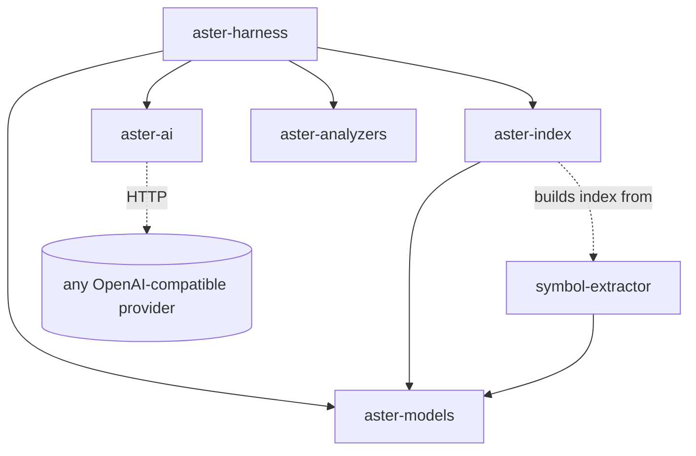
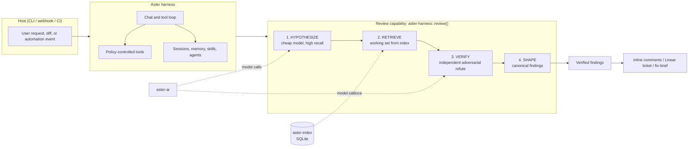

# Aster Architecture

Aster is a **self-hostable agent harness for software work**. It supplies the
runtime primitives—model access, policy, local context, memory, skills, agents,
and tool orchestration—that task capabilities share. Code review is the first
deep, verification-first capability built on those primitives.

## Design thesis

An agent harness should not be a long system prompt wrapped around a model. It
should supply controlled execution, durable context, and narrow task-specific
working sets. Aster follows two rules:

1. **Context is selected, not dumped.** Local indexing, memory, and skills load
   only the material relevant to the current turn. This keeps the model grounded
   and preserves room for the work itself.
2. **Verification is a capability, not a universal tax.** Some tasks need a
   quick, direct agent response; high-impact outputs such as review findings
   benefit from an independent challenge step.

### The review capability

Code review is an **adversarial verification** task, not a generation task. Its
pipeline separates *hypothesis* from *verification* and retrieves narrowly. A
reviewer that trusts its own first-pass output is the implementer certifying its
own work; Aster's review capability refutes candidates before emitting findings.

## Crate layout

```
crates/
  aster-models/      domain types: findings, symbols, PR shapes, Candidate/Verdict
  aster-ai/          provider-agnostic OpenAI-compatible chat client (BYO model)
  aster-index/       zero-dep code index: SQLite + FTS5 + embedded ripgrep
  aster-analyzers/   runtime-selectable static backends: semgrep/ast-grep (CLI)
  symbol-extractor/  tree-sitter-tags symbol extraction (14 languages)
  aster-harness/     verification-first review capability
  aster-persist/     filesystem-first chat transcripts + memory (see MEMORY.md)
  aster-skills/      filesystem-based agent skills: SKILL.md discovery + on-demand load
  aster-mcp/         progressive MCP tool injection: one bridge + scoped catalogue
```

Chat sessions and durable memory are documented separately in
[`MEMORY.md`](./MEMORY.md).

MCP integration is documented in [`MCP.md`](./MCP.md). `aster-mcp` is a
transport-agnostic boundary: it builds the model-visible injection and routes a
resolved real tool to the host. The CLI remains responsible for connecting to
an MCP server, applying approvals, and recording the invocation.

### Dependency graph



The review capability depends on nothing SaaS. The only outbound network call
in its core path is through `aster-ai` to a model endpoint you control via env.

## Runtime shape



## Why a local index instead of a vector DB

Aster retrieves evidence from a zero-external-dependency SQLite index
(tree-sitter symbols + FTS5 + an embedded ripgrep) rather than a hosted vector
store. This keeps the harness self-hostable (`no Docker`, one binary) and makes
retrieval *precise and grep-native*: the engine asks for exactly the symbol,
caller, or type a finding's failure scenario needs, and nothing more.

- **ripgrep (text)** — raw speed for literal/regex lookups across the tree.
- **ast-grep / tree-sitter (structural)** — syntax-aware matches when a finding
  needs to reason over the syntax tree, not characters.

The index is *optional* in `ReviewDeps`: the harness runs on a bare diff and
gets sharper as more evidence sources are wired in.

## The Finding object

Every stage converges on one canonical object (`aster_models::code_review`):

- `ReviewFinding` — location, defect class, severity, `description`
  (the concrete failure scenario), `suggestion`, `confidence`.
- Internally, a `Candidate` carries a **mandatory `failure_scenario`** at birth,
  and a `Verdict` carries the adversarial verifier's `real` / `confidence` /
  `reason`. See [ALGORITHM.md](./ALGORITHM.md).

This object is designed so downstream consumers — inline PR comments, Linear
issue creation, and a future fix-agent — all read the same shape.
