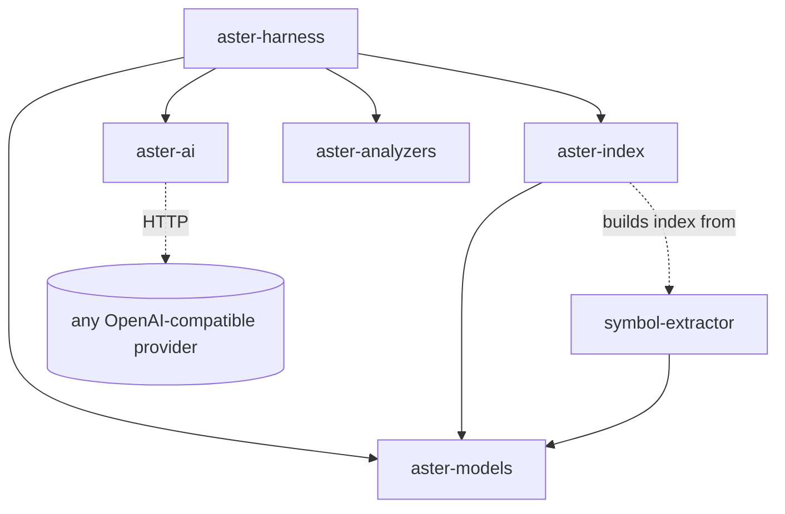
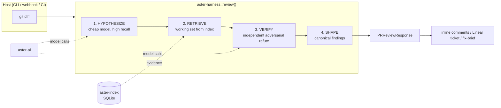

# Aster Architecture

Aster is a **cost-staged, verification-first** code-review harness. This document
describes the crate layout and how a diff becomes a set of verified findings.

## Design thesis

A code review is not a generation task — it is an **adversarial verification**
task. The engine's job is to be an independent verifier of code someone else
wrote. Two consequences follow, and they shape the whole system:

1. **Independent verification is the product, not a feature.** A reviewer that
   trusts its own first-pass output is the "implementer certifying its own work"
   anti-pattern pointed at bugs. Aster splits *hypothesis* from *verification*
   into separate model calls with adversarial prompts.
2. **The cheapest reviewer and the most accurate reviewer are the same
   reviewer.** Cost blows up when you stuff whole files and history into a
   prompt ("inject-first, rescue-later"). Every token you *don't* waste on
   irrelevant context is a token of signal you didn't dilute. Precise retrieval
   makes review both cheap and accurate — they are the same lever.

## Crate layout

```
crates/
  aster-models/      domain types: findings, symbols, PR shapes, Candidate/Verdict
  aster-ai/          provider-agnostic OpenAI-compatible chat client (BYO model)
  aster-index/       zero-dep code index: SQLite + FTS5 + embedded ripgrep
  aster-analyzers/   runtime-selectable static backends: semgrep/ast-grep (CLI)
  symbol-extractor/  tree-sitter-tags symbol extraction (14 languages)
  aster-harness/     the review core: hypothesize → retrieve → verify → shape
  aster-persist/     filesystem-first chat transcripts + memory (see MEMORY.md)
  aster-skills/      filesystem-based agent skills: SKILL.md discovery + on-demand load
```

Chat sessions and durable memory are documented separately in
[`MEMORY.md`](./MEMORY.md).

### Dependency graph



`aster-harness` depends on nothing SaaS. The only outbound network call is
through `aster-ai` to a model endpoint you control via env.

## Runtime shape



## Why a local index instead of a vector DB

Aster retrieves evidence from a zero-external-dependency SQLite index
(tree-sitter symbols + FTS5 + an embedded ripgrep) rather than a hosted vector
store. This keeps the harness self-hostable (`no Docker`, one binary) and makes
retrieval *precise and grep-native*: the engine asks for exactly the symbol,
caller, or type a finding's failure scenario needs, and nothing more.

- **ripgrep (text)** — raw speed for literal/regex lookups across the tree.
- **ast-grep / tree-sitter (structural)** — syntax-aware matches when a finding
  needs to reason over the syntax tree, not characters.

The index is *optional* in `ReviewDeps`: the harness runs on a bare diff and
gets sharper as more evidence sources are wired in.

## The Finding object

Every stage converges on one canonical object (`aster_models::code_review`):

- `ReviewFinding` — location, defect class, severity, `description`
  (the concrete failure scenario), `suggestion`, `confidence`.
- Internally, a `Candidate` carries a **mandatory `failure_scenario`** at birth,
  and a `Verdict` carries the adversarial verifier's `real` / `confidence` /
  `reason`. See [ALGORITHM.md](./ALGORITHM.md).

This object is designed so downstream consumers — inline PR comments, Linear
issue creation, and a future fix-agent — all read the same shape.
