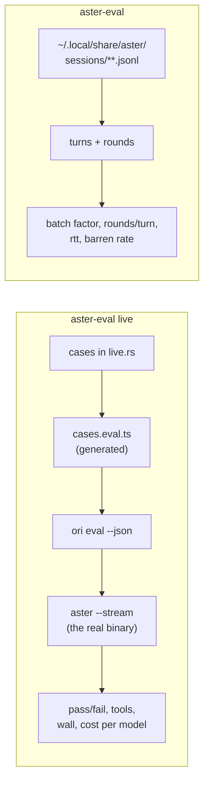

# Evaluation

Aster measures itself two ways, and they answer different questions. **Live
evals** fix the task and vary the model, so a change can be shown to help.
**Session grading** takes ordinary recorded use and asks what it cost. Neither
one subsumes the other: the live suite cannot tell you how Aster behaves on your
actual work, and session grading cannot tell you whether yesterday's commit
helped, because every session ran a different task.

The crate is [aster-eval](../crates/aster-eval). Its output is what
[HARNESS-FINDINGS.md](HARNESS-FINDINGS.md) is written from. The live half runs
on Ori, OpenRouter's agent harness and evaluation runner, with Aster swapped in
for Ori's own agent; [What Ori is](#what-ori-is-and-why-aster-uses-it)
explains that arrangement.



## What a round is, and why it is the metric

A **turn** is everything between one user message and the next. A **round** is
one assistant message that carried at least one tool call, which is exactly one
model round-trip. A round costs a full network round-trip whether it carries one
tool call or seven, so the ratio between them is the lever:

- **Batch factor** = tool calls ÷ rounds. 1.00 means the model never groups
calls and every call cost its own round-trip.
- **Single-call rate** = share of rounds carrying exactly one call. The same
fact from the other side, and the easier one to reason about.
- **Barren rate** = share of tool results that told the model nothing (empty, or
a known no-information reply like `no files matched`). A barren result means
the round that produced it was spent for nothing.

Outcome-only evals are blind to all three. A harness can answer correctly and
still take nineteen round-trips to do it, and the user feels the nineteen.

## Session grading

```
cargo run -p aster-eval
```

Reads every `*.jsonl` under `~/.local/share/aster/sessions` recursively,
rebuilds turns and rounds from the flat transcript, and prints one report.

```
aster-eval [SESSIONS_DIR] [options]

  --since DAYS       only sessions created in the last DAYS days
  --model NAME       only sessions recorded against this model
  --json             machine-readable, for diffing snapshots
  --baseline FILE    compare against an earlier --json report
```

The default directory is `aster_persist::default_home()/sessions`, which is
`~/.local/share/aster/sessions` unless `XDG_DATA_HOME` is set. Note that
`~/.aster` is the *config* root (`aster.yaml`, `.env`, `mcp.json`) and holds
migrated leftovers; it is not where sessions are read from.

### Reading the report

The tool table is where fixes come from. `calls` is volume, `barren` is how
often the tool answered nothing, and the duration columns are per call:

```
tool             calls  barren     p50     p90    total
search_files       242   15.3%   0.03s   0.06s    16.2s
find_files          39   43.6%   0.01s   1.53s    36.8s
```

A high barren rate on a low-volume tool is still worth fixing, because each
barren result usually buys a retry, and each retry is another round.

The model table splits batching by model, which is how you notice that the
model configured for review is the worst batcher in the corpus.

### Comparing two snapshots

```bash
cargo run -p aster-eval -- --json > before.json
# ... change something, use Aster for a while ...
cargo run -p aster-eval -- --baseline before.json
```

`Report::compare` reports six deltas: batch factor, single-call rounds, barren
results, rounds/turn p50, model rtt p50, and active turn p90. Each carries its
own `higher_is_better` flag, so a delta is judged by direction rather than by
magnitude, and a metric that did not move is reported as neither.

One caveat specific to this mode: running Aster to produce the "after" sessions
writes into the same directory the grader reads, so the corpus grows while you
measure it. Freeze a `--json` snapshot before analysing.

## What Ori is, and why Aster uses it

[Ori](https://openrouter.ai/labs/ori) is a tool from OpenRouter. It runs AI
agents, and it tests them.

Three terms come first. The rest of this page uses them.

- A **tool call** is a request from the model. The model asks to read a file, or
  to run a search. It cannot do these things itself.
- A **turn** is one exchange. The user sends a message. The agent makes tool
  calls. The agent then gives an answer.
- A **harness** is the code that runs a turn. It sends the prompt to a model. It
  makes the tool calls that the model asks for. It sends each result back.

Ori has two parts. The first part is a **test runner**. It starts an agent, gives
it a prompt, and then checks what the agent did. The second part is Ori's own
**harness**.

Aster keeps the first part and replaces the second. The test runner is Ori's. The
harness is Aster's. The program under test is therefore Aster.

### How you write a test

A test is a `*.eval.ts` file. `bun:test` runs the file. You call `setupAgent` to
get an agent. You call `agent.run` to give it a prompt. You then check what it
did. Each check reads as a sentence about behaviour:

```ts
const run = await agent.run("What activation events does the extension declare?");
run.tool("edit_file").toNotBeCalled();
run.toMention("activation");
run.toComplete();
```

These three checks say: the agent must not edit a file, the answer must contain
the word `activation`, and the run must finish without an error.

### How Aster supplies its own harness

`defineHarness` gives a harness a name and registers it. Ori then runs that
harness in place of its own. The file must be at `features/<name>/feature.ts`
inside an Ori workspace. For this reason, `crates/aster-eval/evals` is a bun
workspace, and `features/*` is a member of it.

### Why not write a test runner

A test runner is the same for every project. It starts processes. It supplies
the words for the checks. It records each pass and each failure. It measures
time. It prints results that a program can read.

None of that code is special to Aster, but somebody must maintain it. Aster
borrows it instead. Aster then writes only the harness, which is the one part
that is about Aster.

Three results follow:

- The checks test the real `aster` program. They do not test a copy of it.
- One flag selects the model. One command can therefore test many models.
- The report is JSON. Rust code reads it, so no person must read the screen
  output.

### What this costs

Ori and Aster do not count a run the same way.

Ori reports the tool calls as one flat list of names. It does not report which
calls shared a round-trip. Aster therefore cannot write a check about rounds. See
[Known limits](#known-limits-of-the-instruments).

Ori also has no check for an upper limit. `toBeCalledTimes` needs an exact
number. The generated file therefore contains a small `count()` helper. It is
written by hand, and it supplies the `at_most` limits.

## Running the live evals

```bash
cd crates/aster-eval/evals && bun install
cargo run -p aster-eval -- live --models z-ai/glm-5.2,deepseek-chat
```

Needs `ori` on PATH (or `ORI_BIN`), `bun`, and a credential for whatever endpoint
the models live on. `ASTER_BIN` selects which binary to measure (default: `aster`
on PATH), `--repo` the checkout it runs against, `--evals` the workspace.

The driver renders the cases to `cases.eval.ts`, shells out to
`ori eval --json --no-history`, parses the report, and prints one row per model
plus a per-case tool summary. It exits non-zero if any case failed.

### How the harness works

Aster's harness lives in
[evals/features/aster/feature.ts](../crates/aster-eval/evals/features/aster/feature.ts).
It spawns `aster --stream` as a subprocess and translates its NDJSON into Ori's
event vocabulary:

| Aster emits         | Ori receives                           |
| ------------------- | -------------------------------------- |
| `token` / `text`    | `assistant.text.delta`                 |
| `tool_call`         | `tool.started`                         |
| `tool_result`       | `tool.succeeded` / `tool.failed`       |
| `done` (with usage) | `turn.succeeded` + `session.succeeded` |
| `error`             | `turn.failed` + `session.failed`       |

Ori keeps scheduling, assertions, and reporting. It loses the agent loop, which
is the whole point: the assertions then apply to the shipped binary. A case that
needs a system prompt goes through `--messages-json` rather than a positional
prompt, since that is the only way `aster` accepts one.

**Ori falls back to its own agent when a harness fails to boot**, and every
assertion would pass green against the wrong subject. `summarise()` in
[live.rs](../crates/aster-eval/src/live.rs) therefore reads `terminal.harness`
out of the report and refuses to count a case as passed unless it says `aster`.
A run that hit the fallback prints the harness it actually used. Check the
feature independently with `ori harness test --harness aster`.

### Adding a case

Cases live in `default_cases()` in [live.rs](../crates/aster-eval/src/live.rs)
and are rendered to `cases.eval.ts`, which is generated and gitignored. Rust is
the source of truth; TypeScript is only what Ori insists on. Edit the Rust.

```rust
Case {
    name: "does not re-run an identical search".into(),
    prompt: "Which function in crates/aster-tools decides whether a directory \
             is skipped? Name it and the file it lives in.".into(),
    must_mention: Some("is_skipped".into()),
    calls: Vec::new(),                       // tools that must run
    avoids: vec!["edit_file".into()],        // tools that must never run
    at_most: vec![("search_files".into(), 3)], // per-tool ceilings
}
```

Each case encodes a harness fix, so a regression in that fix fails an eval
instead of going unnoticed until the next findings pass. The ceilings are the
part that catches waste: a regression usually shows up as the answer staying
correct while the call count climbs.

## Known limits of the instruments

These bound what the numbers above can claim. State them alongside any result
taken from this crate.

**A ceiling on an uncalled tool passes vacuously.** `at_most` counts one named
tool. When the model reaches the answer with a different tool the count is zero
and the assertion passes without constraining anything. A case capping
`find_files` at five passes on a run that only called `search_files`. Prefer a
ceiling on the tool the case is actually about, and pair it with `calls` so the
tool must run at all.

**The live suite cannot see a round.** Ori reports tool calls as a flat list and
the harness emits one event per call with no round grouping, so call counts
survive the translation and round boundaries do not. The live suite therefore
measures calls, and is structurally blind to the batch factor. A case named for
batching can only assert a call count today.

**Single runs are noise.** The same case on the same model has produced
`explore×1` on one run and `find_files×2 read_file×2` on the next; earlier
measurements varied 1, 1, 3, 2 on one case. Take a median of N before believing
a difference between models or builds.

**A batched round charges every call the slowest one's wall time.**
[turn.rs](../crates/aster-eval/src/turn.rs) measures from the assistant
message that issued a call to the tool message that returned it, and every
result in a round shares one recorded timestamp. One two-call round recorded
`list_files` and `aster_mcp` at 72.98s each, identical to the hundredth. Per-tool
duration is only trustworthy for tools that predominantly appear alone. Call
counts, barren rates, round counts, and the batch factor do not depend on
duration and are unaffected. Fixing this needs per-call timestamps in the
transcript, which the format does not carry yet.

**Cost is a token proxy, not money.** `UsageSnapshot` prices prompt and
completion tokens at one global rate pair (`ASTER_PRICE_PROMPT_PER_M`,
`ASTER_PRICE_COMPLETION_PER_M`, defaulting to 0.15/0.60), with no per-model
table and no discount for cached input. In a `--models` sweep every model is
priced identically, so the cost column ranks by token volume alone. The
"fewest calls" recommendation is unaffected because it ranks on call count.
`Usage` also parses only `prompt_tokens` and `completion_tokens`, so
provider-side cache hits are invisible.

**A session corpus is not a controlled workload.** Sessions accumulate from real
use across different repos and tasks, so per-model splits are confounded with
the task mix each model happened to receive. Aggregates over the whole corpus
are the robust part. A causal per-model claim needs the same task set across
models, which is the live suite's job.

## Where the numbers go

Findings from a grading pass land in
[HARNESS-FINDINGS.md](HARNESS-FINDINGS.md) with their evidence and the shape of
a fix. When a fix ships, it moves to the changelog and, where a live eval can
hold the line, becomes a case in `default_cases()`.

[ROADMAP.md](ROADMAP.md#2-aster-eval-measurement-as-infrastructure) describes a
further axis this crate does not cover yet: scoring recall and precision against
planted defects for review and fix runs, storing results keyed by config hash,
and sweeping one configuration axis at a time.