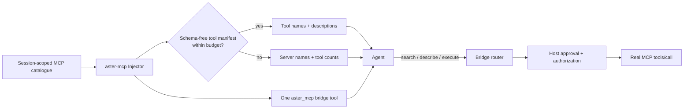

# Progressive MCP injection

`aster-mcp` lets an Aster host connect many Model Context Protocol (MCP)
servers without placing every tool schema in every model request. It injects a
single `aster_mcp` bridge tool and reveals capability information in stages.

The crate owns **catalogue shaping and routing**. A host owns MCP connection
lifecycles, credentials, authorization, user approval, logging, and the actual
`tools/call` request.

## Why this exists

MCP servers normally expose a full list of tool names, descriptions, and JSON
schemas. A large, stable schema list may benefit from provider prompt caching,
but it still occupies the model's working context and forces the model to
choose from many irrelevant operations.

For Aster, that is the wrong direction. The review and chat harnesses already
use selective evidence retrieval: give the model the smallest useful working
set, then retrieve detail when the task calls for it. Progressive MCP injection
applies the same rule to capabilities.

## Design



The model always sees the bridge when the session has at least one permitted
MCP tool. It sees either:

- a schema-free `server/tool` manifest when the names and descriptions fit the
  configured context budget, or
- a compact server inventory when that manifest would exceed the budget.

The default budget is 6% of the context still available to the prompt. The host
must calculate that value *after* reserving the system prompt, conversation,
and desired completion budget. This makes disclosure adapt to the actual turn,
rather than relying on a fixed number of tools.

Full input schemas are never inserted into the system prompt. The model calls
`describe` to load one schema, then uses `execute` with the corresponding
`server/tool` identity. This is intentionally analogous to Aster skills:
manifest first, full content only on demand.

## The bridge protocol

`aster_mcp` is an OpenAI-compatible function definition. Its arguments have
one required field, `action`.

| Action | Required fields | Result | Side effect |
| --- | --- | --- | --- |
| `search` | `query`; optional `limit` | Ranked tool IDs and descriptions | none |
| `describe` | `name` | Exact input schema for that tool | none |
| `execute` | `name`, `arguments` | Host-provided MCP result | invokes the resolved real tool |

The bridge never accepts a bare tool name. IDs are `server/tool`, avoiding
collisions between servers and preserving an audit-friendly target.

`search` uses deterministic lexical ranking across tool names, descriptions,
and input-schema text. It is local, reproducible, and requires no embedding
service. The ranking implementation is deliberately replaceable: hosts can
pre-filter a session catalogue or add a stronger retrieval layer without
changing the visible bridge protocol.

## Safety invariants

1. **Session scoping.** Build `McpCatalog` from the tools enabled for this
   session only. A sub-agent or restricted chat cannot discover a tool merely
   because it exists elsewhere in the Aster process.
2. **Authorize the real tool.** The bridge is an envelope, not a permission.
   Before executing, evaluate policy and approval against the resolved
   `server/tool` identity and arguments.
3. **Describe before execute.** The injected prompt tells the model not to
   invent parameter names. A host may enforce this more strictly by tracking
   described tools per turn.
4. **Do not treat descriptions as instructions.** Tool names and descriptions
   come from external MCP servers. Render them as data, never concatenate them
   into privileged policy instructions.
5. **No catalogue leakage.** `describe` and `execute` reject any ID absent
   from the session catalogue. Search results are generated from the same
   catalogue.
6. **Audit the unwrapped call.** Record the resolved ID, approval decision,
   arguments (redacted as needed), and upstream result—not only `aster_mcp`.

## Rust API reference

### `McpTool` and `McpCatalog`

`McpTool` stores a server name, tool name, description, and the unmodified MCP
input schema. `McpCatalog::new` validates non-empty fields, object schemas, and
unique `server/tool` IDs.

`McpCatalog::search(query, limit)` returns schema-free `ToolMatch` values.
`McpCatalog::get(id)` resolves a tool only by its full ID.

### `ProgressiveConfig`

| Field | Default | Meaning |
| --- | ---: | --- |
| `available_context_tokens` | `100_000` | Tokens left after host reservations. Required to be greater than zero. |
| `inventory_threshold_percent` | `6.0` | Maximum percentage of available context used by the direct manifest. Range: `(0, 100]`. |
| `search_default_limit` | `5` | Result count when the model does not provide `limit`. |
| `max_search_limit` | `20` | Maximum accepted model-supplied search limit. |

The token decision uses a conservative local estimate of one token per four
Unicode characters. A provider-specific tokenizer can be accommodated by
passing a correspondingly reduced `available_context_tokens`; the crate never
claims that its estimate is a billing count.

### `Injector`

`Injector::new(catalog, config)` validates configuration. `Injector::inject()`
returns `None` for an empty catalogue; otherwise it returns an `Injection`:

- `bridge_tool`: the one function definition to append to the host's tools
  array;
- `prompt`: the system-prompt section containing either the tool or server
  manifest;
- `inventory`: structured form of that manifest for diagnostics;
- `manifest_tokens` and `inventory_budget_tokens`: threshold-observability
  values.

`Injector::route(arguments)` parses model-supplied bridge arguments and returns
a `BridgeAction`. An execute action includes an already-resolved `McpTool`; it
cannot be silently redirected to a different target.

`Injector::handle(arguments, invoker)` is a convenience layer. The supplied
`McpInvoker` receives the resolved real tool and arguments. Its implementation
is the correct place to perform authorization, approval, transport dispatch,
and result redaction.

## Host integration

The following is the intended integration point for a chat or agent loop:

```rust
use aster_mcp::{Injector, McpCatalog, McpTool, ProgressiveConfig};
use serde_json::json;

let catalogue = McpCatalog::new(vec![McpTool {
    server: "github".into(),
    name: "create_issue".into(),
    description: "Create a GitHub issue in a repository.".into(),
    input_schema: json!({ "type": "object", "properties": {
        "title": { "type": "string" }
    }, "required": ["title"] }),
}])?;

let injector = Injector::new(catalogue, ProgressiveConfig {
    // Calculated by the host for this specific model turn.
    available_context_tokens: 42_000,
    ..ProgressiveConfig::default()
})?;

if let Some(injection) = injector.inject() {
    system_prompt.push_str("\n\n");
    system_prompt.push_str(&injection.prompt);
    tools.push(injection.bridge_tool);
}
```

When the model calls `aster_mcp`, route it through an invoker that controls the
real MCP client:

```rust
use aster_mcp::{McpInvoker, McpTool};
use serde_json::Value;

struct ApprovedMcp<'a> { /* authenticated MCP sessions and policy */ }

impl McpInvoker for ApprovedMcp<'_> {
    fn invoke(&mut self, tool: &McpTool, arguments: &Value) -> anyhow::Result<Value> {
        // 1. Authorize `tool.id()` and these arguments.
        // 2. Request user approval when required.
        // 3. Dispatch MCP tools/call with tool.name and arguments.
        // 4. Redact and audit the result.
        todo!()
    }
}

let result = injector.handle(&model_arguments, &mut approved_mcp)?;
```

The current crate intentionally stops at this boundary; it does not configure
or start MCP servers. That prevents a context optimization layer from gaining
unreviewed access to credentials or bypassing Aster's policy engine.

## Operational guidance

- Keep a small number of common, safety-critical native Aster tools directly
  exposed. `aster-mcp` applies to external MCP tools, not Aster's core file and
  policy tools.
- Use concise, user-language descriptions. Tool discovery is only as reliable
  as the catalogue metadata.
- Set a server's tools to the session catalogue only after authentication and
  capability filtering.
- Track manifest tokens, selected tool IDs, empty searches, describe-to-execute
  conversions, approval denials, and upstream failures. These reveal whether
  the catalogue or descriptions need improvement.
- Evaluate retrieval recall and wrong-tool calls on Aster tasks before changing
  the 6% threshold. Smaller budgets reduce context use but can add a search
  round-trip for tools that would otherwise be obvious.

## Non-goals

`aster-mcp` does not implement an MCP client transport, server installation,
OAuth, prompt caching, semantic/vector retrieval, or unrestricted tool
execution. Those belong to host-specific adapters and Aster's policy boundary.
