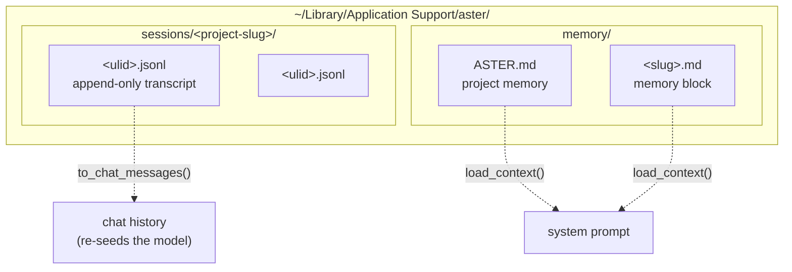
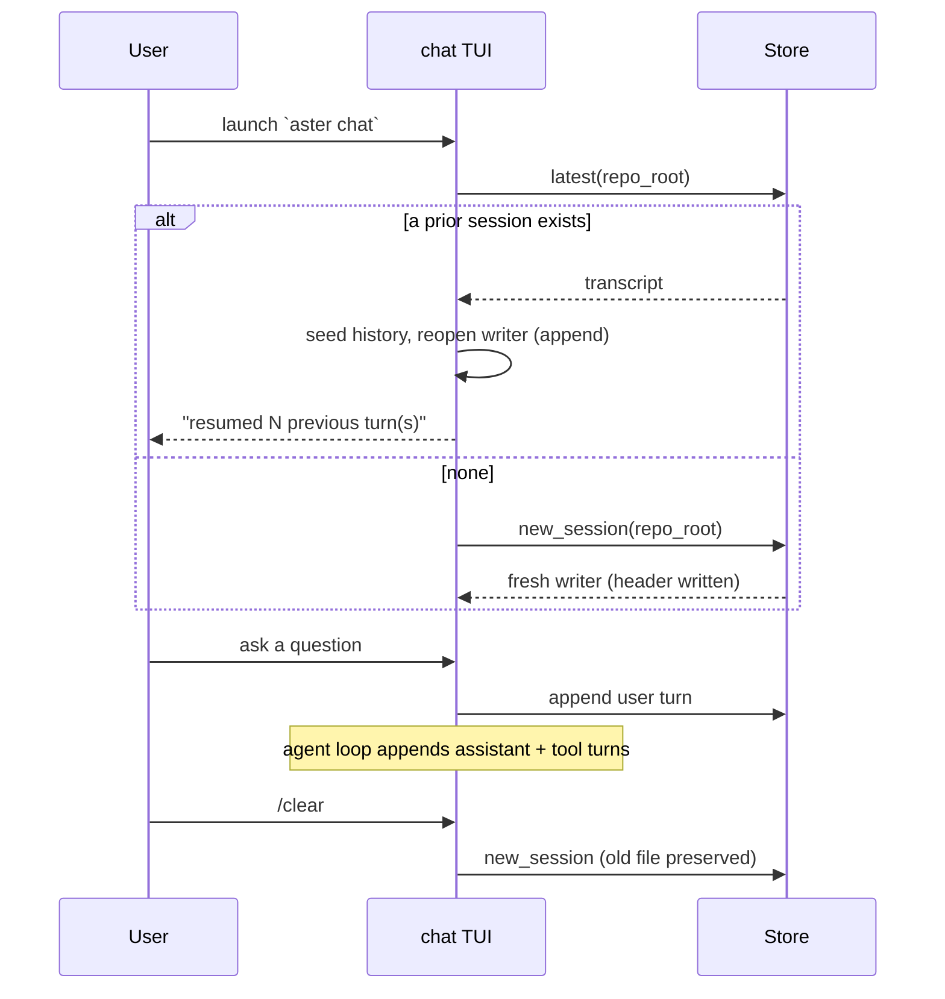
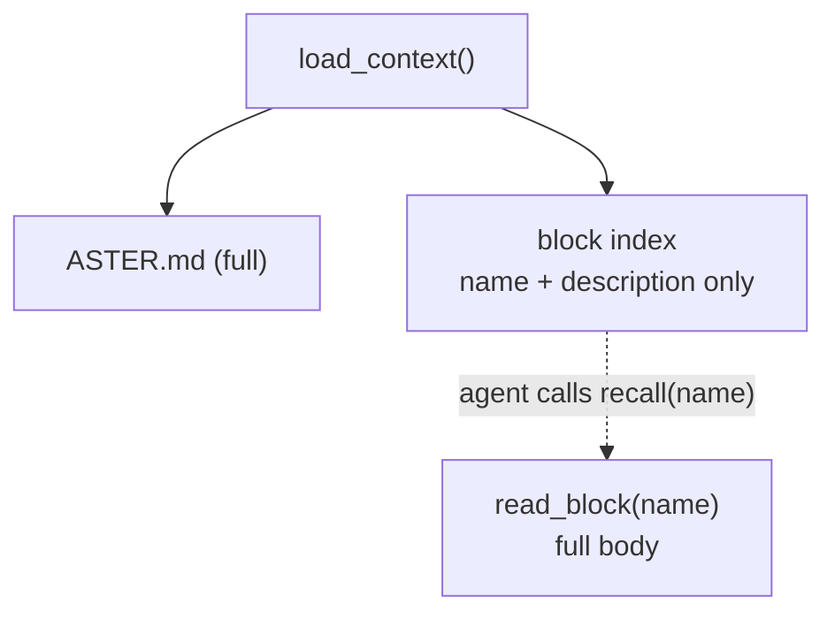
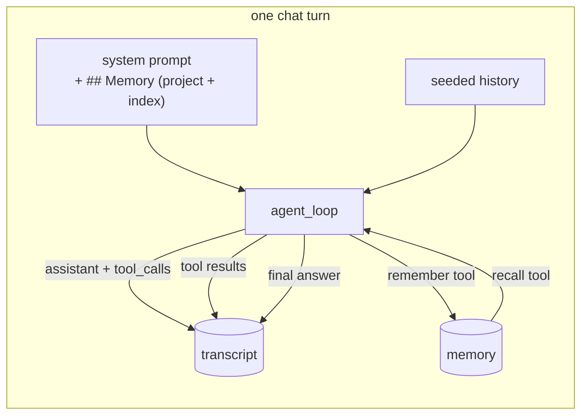

# Memory & Persistence

Aster keeps two kinds of durable state: a **transcript** of every chat session,
and a **memory** of facts that outlive any single session. Both live on the
filesystem as plain files. This document explains the model, the on-disk layout,
and how it plugs into the chat loop.

The crate is [`aster-persist`](../crates/aster-persist). It has no database and
no network dependency.

## Design thesis: filesystem-first

The store of record is the filesystem, not SQL. This follows how the reference
coding agents actually work (see [References](#references)).

Three properties fall out of an append-only log that a relational table would
fight:

1. **Crash safety.** A half-written last line is tolerable; a resume drops it and
   keeps everything before it.
2. **Full fidelity for free.** Recording a turn means appending the raw event,
   including the assistant's tool calls and each tool result. No schema
   gymnastics to model those shapes as rows.
3. **Portable and inspectable.** A session is one human-readable file you can
   `cat`, `grep`, diff, or delete.

SQLite is used elsewhere in Aster (`aster-index`) strictly as a rebuildable,
disposable index, never as the source of truth. Persistence keeps that stance: a
queryable recall index over transcripts and memory is a later, optional layer
that can always be rebuilt from the files.

## Two layers, kept separate



- **Transcript** is raw history: what was said and done, in order, with full
  fidelity. It is never edited, only appended to.
- **Memory** is distilled, durable facts. It is small, human- and agent-editable,
  and injected into the system prompt on every turn.

The separation is deliberate. Transcript answers "what happened in this session";
memory answers "what should Aster always know about this project."

## On-disk layout

Everything lives under the existing Aster home (the same directory that holds
`aster.yaml` and `credentials.json`), resolved via `dirs::config_dir()`:

```
<config>/aster/
  sessions/<project-slug>/<ulid>.jsonl   append-only transcripts, scoped per repo
  memory/ASTER.md                        project memory, always loaded
  memory/<slug>.md                        individual memory blocks with frontmatter
```

- `<project-slug>` is the repository root path, slugified, so sessions are scoped
  to the repo they ran in.
- `<ulid>` is a lexicographically sortable, time-ordered id, so the newest
  session is simply the last one by filename.

## The transcript format

Each session file is JSONL: one JSON object per line. The first line is a session
header; every line after it is an event. Events are internally tagged on `type`,
so the file is self-describing.

```jsonl
{"type":"session","id":"01J...","v":1,"created_at":"...","cwd":"/repo","repo_root":"/repo","model":"..."}
{"type":"message","role":"user","content":"read main.rs","ts":"..."}
{"type":"message","role":"assistant","tool_calls":[{"id":"call_1","type":"function","function":{"name":"read_file","arguments":"{\"path\":\"main.rs\"}"}}],"ts":"..."}
{"type":"message","role":"tool","tool_call_id":"call_1","content":"fn main() {}","ts":"..."}
{"type":"message","role":"assistant","content":"It is the entrypoint.","ts":"..."}
```

Event kinds (`TranscriptEvent`):

| kind      | purpose                                                                 |
|-----------|-------------------------------------------------------------------------|
| `session` | the header: id, version, created-at, cwd, repo root, model              |
| `message` | one turn: `user`, `assistant` (with optional `tool_calls`), or `tool`   |
| `summary` | a compaction marker (older turns folded into a summary; see below)      |

### Full-fidelity capture

This is the part that fixes "aster forgets." The in-memory chat history only ever
held `user` and `assistant` **text**; the assistant's tool calls and their
results were discarded after each turn. The transcript records all of it. As the
agent loop runs, it appends:

1. the assistant turn, including its `tool_calls`,
2. one `tool` event per result, linked back by `tool_call_id`,
3. the final assistant answer.

So a resumed or inspected session shows not just the conclusions but the work:
which files were read, what was searched, what each tool returned.

### Resume and reconstruction

`SessionTranscript::to_chat_messages()` rebuilds the plain `user`/`assistant`
history the chat UI carries forward. Tool events stay in the file but are omitted
from the rebuilt history (the agent re-runs tools fresh on the next turn). If the
session has been compacted, the latest `summary` is surfaced as a leading context
turn.

## Session lifecycle



- **Default is resume.** On launch the chat TUI continues the repo's most recent
  session, seeding both the visible scrollback and the model's history.
- **`/clear` starts a fresh session.** It does not delete anything; the previous
  transcript stays on disk, and a new file begins.

## Memory

Memory is markdown. It loads into the system prompt on every turn via
`MemoryStore::load_context()`, but it does **not** dump everything into the
prompt. It uses **progressive disclosure**: load a little always, and let the
agent pull the rest on demand.

Every turn, `load_context()` injects only:

- `ASTER.md`, the project-memory file (a short list of durable gotchas), and
- an **index** of the memory blocks: each block's `name` and `description` from
  its frontmatter, under a `### Recallable memory` heading, with a note to call
  `recall(name)` before relying on one.

The full body of a block is loaded only when the agent asks for it. This keeps the
system prompt small and on-signal as memory grows, instead of ballooning it with
facts irrelevant to the current turn. It mirrors the ["tree of files loaded at the
right time"][claude5-rules] principle: the API-conventions block reaches the model
when the agent is touching the API, not while it is fixing a typo.



### The two memory tools

Memory is a read/write loop the agent drives itself (the Letta memory-edit
pattern):

- **`remember(note, title?)`** writes. With a `title` it creates a named block;
  without one it appends the note to `ASTER.md`.
- **`recall(name)`** reads one block's full body on demand, using a name from the
  index in the system prompt.

Both tools carry their guidance in their own descriptions rather than in the
system prompt.

### Populating memory

1. **The tools above**, driven by the model mid-session.
2. **By hand.** `ASTER.md` and the block files are plain markdown you can edit
   directly.

### What belongs in `ASTER.md`

Keep it lightweight: gotchas, conventions, and preferences that are **not**
obvious from the file system or the code. Do not restate things the agent can see
by reading the repo. A memory that says "the project is a Rust workspace" wastes
prompt budget; one that says "review findings must stay below `min_confidence` or
they are dropped" earns its place.

## How it plugs into the chat loop



The persistence handles are threaded through the turn as a `SessionCtx`: a live
append handle for this session's transcript, plus the `Store` used to read and
write memory. Headless turns get memory injection but no transcript writer;
interactive turns get both.

## Compaction

The transcript keeps every turn forever, so a long session eventually outgrows
the window. When the in-context history crosses a size budget, `agent_loop` folds
the older turns into a summary before the model call: it summarizes everything
except the recent tail, records a `summary` event to the transcript, and replaces
the in-context history with the summary plus the tail. The file stays complete;
only the window shrinks. The interactive TUI adopts the compacted history so the
saving persists across turns instead of re-summarizing each time.

## Surfaces

- **Interactive TUI** (`aster chat`): resumes the repo's latest session by default.
- **Headless** (`aster chat --continue` or `--session <id>`): resumes a session
  without replaying history, and a bare prompt starts a fresh resumable session.
- **`aster sessions [list|show <id>]`** and **`aster memory [list|add]`**: inspect
  and edit persisted state from the terminal, with `--json` for tools.
- **Desktop app**: the same commands are exposed as Tauri calls
  (`list_sessions`, `show_session`, `memory_list`, `memory_add`), and chat turns
  receive injected memory like every other surface.

## What is deferred

- **Auto end-of-session distillation** of memory: save what is relevant to the
  work and the user, not every fact stated (memory is tool-driven and manual today).
- **A derived SQLite/FTS5 recall index** over transcripts and memory, added only
  when a linear scan across files gets slow. It would be rebuildable from the
  files, never authoritative.

See [`ARCHITECTURE.md`](./ARCHITECTURE.md) for the review engine, and the crate
source in [`crates/aster-persist`](../crates/aster-persist) for the types.

## References

Prior art and the principles this design draws on:

- [Codex][codex] — append-only JSONL session rollouts.
- [Claude Code][claude-code] — per-session JSONL transcripts, markdown memory.
- [Letta: trajectory][letta] — separating message history from editable memory.
- [Anthropic: effective context engineering for AI agents][context-engineering] —
  the general framing.
- [The new rules of context engineering for Claude 5 models][claude5-rules] —
  progressive disclosure, auto-memory, and instructions in tool descriptions.

[codex]: https://github.com/openai/codex
[claude-code]: https://github.com/anthropics/claude-code
[letta]: https://www.letta.com/blog/trajectory
[context-engineering]: https://www.anthropic.com/engineering/effective-context-engineering-for-ai-agents
[claude5-rules]: https://x.com/trq212/status/2080710971228918066
